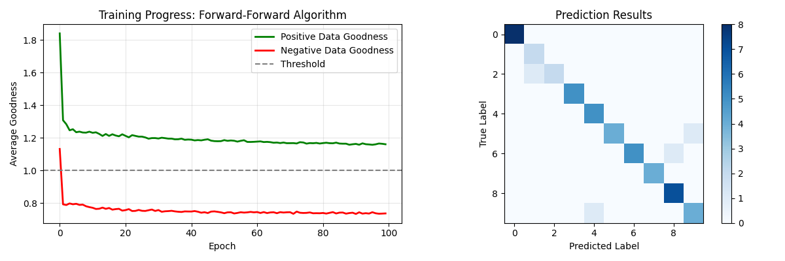

# Overview

Hinton proposed an alternative to Backpropagation in 2022:
[Paper: The Forward-Forward Algorithm: Some Preliminary Investigations](https://arxiv.org/pdf/2212.13345)

- The Forward-Forward algorithm is an alternative to backpropagation for training neural networks, proposed by Geoffrey Hinton in 2022.
- Instead of propagating error signals backward through the network, each layer learns locally using only forward passes.
- The network is trained on two types of data: "positive" data (real examples) and "negative" data (corrupted or mislabeled examples).
- Each layer tries to produce high activation (measured as "goodness" - the sum of squared activations) for positive data and low activation for negative data.
- The goodness function acts as a local objective that each layer optimizes independently, without waiting for feedback from subsequent layers.
- During training, positive examples are created by combining real input data with their correct labels, while negative examples use the same inputs with incorrect labels or added noise.
- Each layer adjusts its weights to push the goodness of positive data above a threshold and the goodness of negative data below it.
- For classification, the network tests each possible label with the input and selects the one that produces the highest overall goodness.
- This approach is more biologically plausible than backpropagation since the brain likely doesn't implement the complex backward pass required by traditional deep learning.
- While currently less accurate than backpropagation on complex tasks, the algorithm offers advantages in energy efficiency, parallelization potential, and could work better with future neuromorphic hardware.

# Example usage

<pre>
<code>
python 01_forward_forward_algorithm_mnist_example.py --epochs 60 --samples 5000 --lr 0.015 --batch-size 16 --hidden-dims 512 256
</code>
</pre>

# Example run output

<pre>
> python 01_forward_forward_algorithm_mnist_example.py --epochs 100 --samples 10000 --lr 0.015 --batch-size 16 --hidden-dims 512 256
 128
============================================================
FORWARD-FORWARD ALGORITHM ON MNIST
============================================================
Configuration:
  Samples: 10000
  Epochs: 100
  Batch size: 16
  Learning rate: 0.015
  Threshold: 1.0
  Hidden dims: [512, 256, 128]
  Eval samples: 50
============================================================
Loading MNIST data (n_samples=10000)...
Train samples: 8000, Test samples: 2000

Network architecture: 794 -> 512 -> 256 -> 128

Training network...
Training for 100 epochs with batch size 16
Total batches per epoch: 500
--------------------------------------------------
Epoch  10/100 - Pos: 1.238, Neg: 0.776, Diff: 0.462, Time: 35.4s
Epoch  20/100 - Pos: 1.222, Neg: 0.755, Diff: 0.468, Time: 111.2s
Epoch  30/100 - Pos: 1.199, Neg: 0.753, Diff: 0.446, Time: 177.9s
Epoch  40/100 - Pos: 1.190, Neg: 0.749, Diff: 0.441, Time: 238.3s
Epoch  50/100 - Pos: 1.180, Neg: 0.744, Diff: 0.436, Time: 280.7s
Epoch  60/100 - Pos: 1.176, Neg: 0.744, Diff: 0.432, Time: 330.8s
Epoch  70/100 - Pos: 1.168, Neg: 0.745, Diff: 0.423, Time: 377.0s
Epoch  80/100 - Pos: 1.166, Neg: 0.739, Diff: 0.427, Time: 432.7s
Epoch  90/100 - Pos: 1.161, Neg: 0.742, Diff: 0.419, Time: 484.7s
Epoch 100/100 - Pos: 1.161, Neg: 0.738, Diff: 0.424, Time: 526.9s

Training completed in 526.86 seconds

Evaluating on 50 test samples...

============================================================
RESULTS SUMMARY
============================================================
Test accuracy: 92.0% (46/50)
Final positive goodness: 1.161
Final negative goodness: 0.738
Goodness separation: 0.424

Example predictions (first 10 samples):
  ✗ True: 2, Predicted: 1
  ✓ True: 8, Predicted: 8
  ✓ True: 6, Predicted: 6
  ✓ True: 3, Predicted: 3
  ✓ True: 8, Predicted: 8
  ✓ True: 3, Predicted: 3
  ✓ True: 4, Predicted: 4
  ✓ True: 0, Predicted: 0
  ✓ True: 5, Predicted: 5
  ✓ True: 8, Predicted: 8

============================================================
Training completed!
</pre>

# CLI Parameters

| Parameter | Type | Default | Description |
|-----------|------|---------|-------------|
| `--samples` | int | 2000 | Number of MNIST samples to use |
| `--test-size` | float | 0.2 | Fraction of data to use for testing (0.0-1.0) |
| `--epochs` | int | 20 | Number of training epochs |
| `--batch-size` | int | 32 | Batch size for training |
| `--lr` | float | 0.01 | Learning rate for all layers |
| `--threshold` | float | 1.0 | Goodness threshold for positive/negative separation |
| `--hidden-dims` | int+ | [256, 128] | Hidden layer dimensions (multiple values allowed) |
| `--eval-samples` | int | 50 | Number of test samples for evaluation |
| `--no-plot` | flag | False | Disable visualization plots |
| `--verbose` | flag | False | Enable verbose output during prediction |
| `--seed` | int | 42 | Random seed for reproducibility |

# Troubleshooting

| Problem | Parameter Adjustment |
|---------|---------------------|
| Accuracy too low | Increase `--epochs`, lower `--lr`, enlarge `--hidden-dims` |
| Training too slow | Reduce `--samples`, increase `--batch-size` |
| Overfitting | Lower `--lr`, smaller `--hidden-dims` |
| Unstable goodness | Lower `--lr`, adjust `--threshold` |
| Poor separation | Lower `--threshold`, more `--epochs` |
